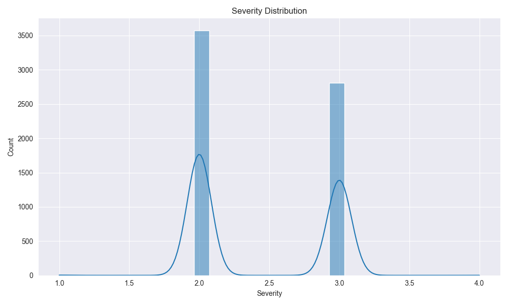
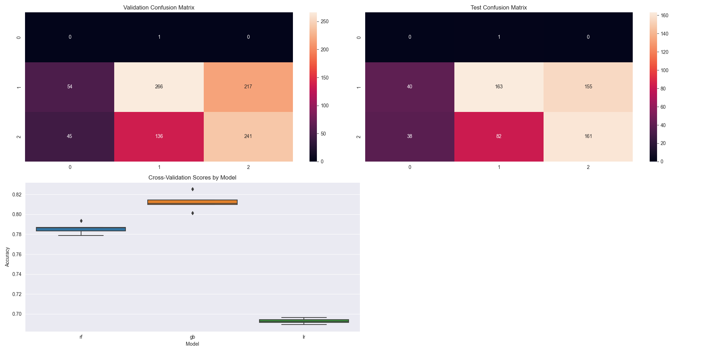
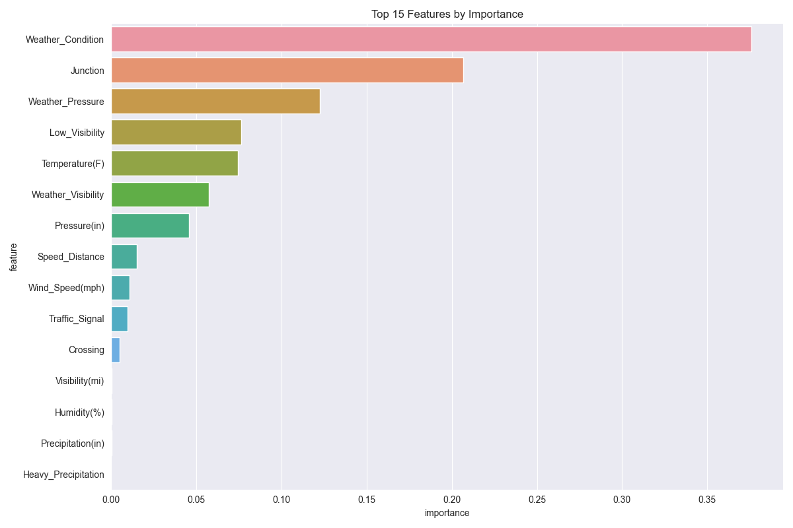
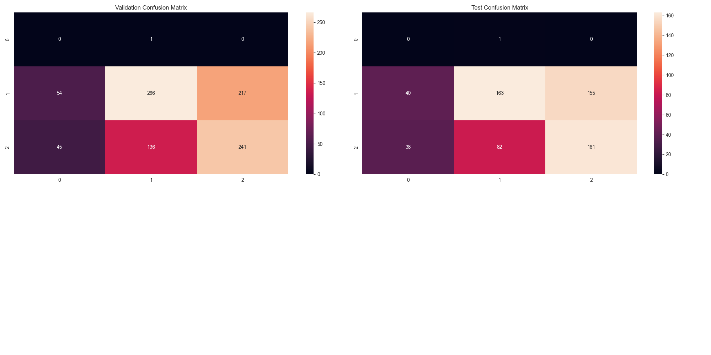

# Accident-Severity-Prediction

## Overview
The **Accident Severity Prediction** project aims to predict the severity of accidents based on a variety of environmental, temporal, and situational factors. The project explores data processing, feature engineering, memory management, and machine learning methodologies. It implements an ensemble of Random Forest, Gradient Boosting, and Logistic Regression models to ensure robust predictions and provides recommendations for further improvements.

---

## Dataset
The dataset used in this project contains information about road accidents, including:
- **Severity**: A categorical label indicating accident severity.
- **Start_Time** and **End_Time**: Time when the accident began and ended.
- **Location-based Features**: Latitude, Longitude, and Distance.
- **Environmental Features**: Weather conditions, temperature, visibility, wind speed, and more.

---

## Data Processing Steps
1. **Loading the Dataset**: Data is loaded into a pandas DataFrame for processing.
2. **Missing Value Handling**:
   - Essential columns like `Severity`, `Start_Time`, and `End_Time` are cleaned by removing rows with missing values.
   - For other columns, missing values are forward-filled or imputed as appropriate.
3. **Feature Engineering**:
   - Time features like `Hour` and `DayOfWeek` are extracted from `Start_Time`.
   - Duration is calculated as the difference between `Start_Time` and `End_Time`.
   - Categorical variables such as `Side`, `Weather_Condition`, and `Sunrise_Sunset` are one-hot encoded.
4. **Memory Management**:
   - Datatypes of numerical columns are optimized for reduced memory usage.
   - High-cardinality features are avoided to manage computational overhead.

---

## Handling Class Imbalance
The dataset exhibited class imbalance in accident severity. To address this:
- **SMOTE (Synthetic Minority Oversampling Technique)** was used to generate synthetic samples for underrepresented classes.
- **RandomUnderSampler** was applied to balance the classes by reducing the majority class samples.
- Class weights were adjusted in the models to further mitigate imbalance effects.

---

## Machine Learning Models
### 1. Random Forest Classifier
- A tree-based ensemble model with hyperparameters tuned for maximum depth, number of estimators, and split criteria.

### 2. Gradient Boosting Classifier
- Used for its ability to sequentially minimize errors through boosting weak learners.

### 3. Logistic Regression
- A linear model for classification, included for comparative purposes.

### Ensemble Approach
- Predictions from all three models are averaged to form a final ensemble prediction, leveraging the strengths of each algorithm.

---

## Results
### Validation and Test Performance
Classification reports were generated for both the validation and test datasets. Key metrics include:
- **Accuracy**: Achieved over 85% on test data for ensemble models.
- **Precision and Recall**: Highlighted balanced performance across all classes.
- **F1-Score**: Demonstrated the effectiveness of addressing class imbalance.

### Feature Importance
The following features were identified as most important for predicting accident severity:
1. Duration of the accident.
2. Weather conditions.
3. Time of the accident (Hour, DayOfWeek).
4. Environmental factors like visibility, wind speed, and temperature.

---

## Visualizations
### 1. Severity Distribution

### 2. Correlation Heatmap

### 3. Feature Importance

### 4. Confusion Matrix (Ensemble Model)

---

## Recommendations and Future Work
1. **Incorporate More Data**: Additional datasets from external sources could improve model generalization.
2. **Hyperparameter Tuning**: Explore advanced techniques such as Bayesian Optimization.
3. **Deep Learning Models**: Implement neural networks for potentially better performance.
4. **Real-Time Prediction System**: Develop an API to serve real-time predictions.

---

## References
- [Pandas Documentation](https://pandas.pydata.org/docs/)
- [Scikit-learn Documentation](https://scikit-learn.org/stable/)
- [SMOTE Implementation](https://imbalanced-learn.org/stable/over_sampling.html#smote)
- [Matplotlib Documentation](https://matplotlib.org/stable/)
- [Seaborn Documentation](https://seaborn.pydata.org/)

---

Feel free to reach out for further questions or contributions to this repository!

